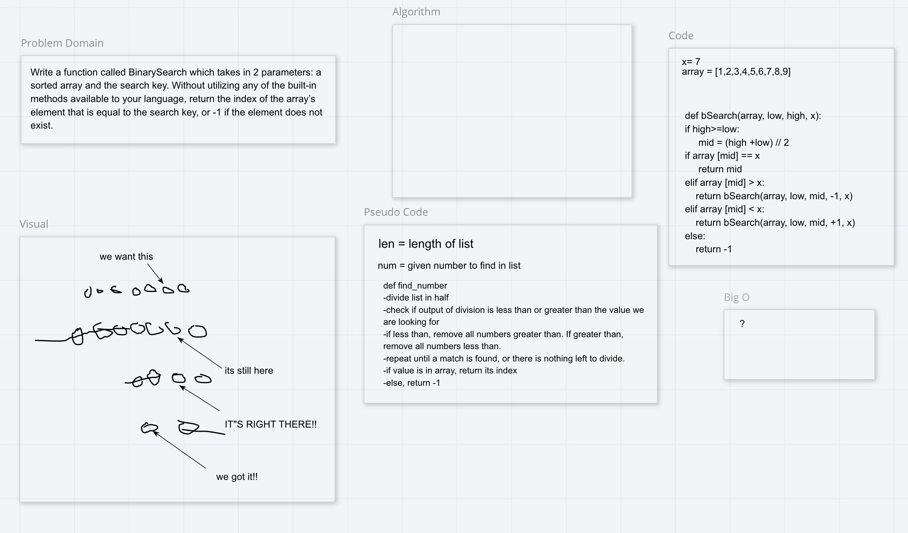

# Challenge Summary
make a function that finds a given number in a list using binary search.

## Challenge Description
Write a function called BinarySearch which takes in 2 parameters: a sorted array and the search key. Without utilizing any of the built-in methods available to your language, return the index of the array’s element that is equal to the search key, or -1 if the element does not exist.

## Approach & Efficiency
We want to get the length of the array, divide it by two and test to see if out desired number is greater than, equal to, or less than the divided number. If greater than we will drop all numbers greater than out divided output. vise versa for less than, and repeat until our desired number is found.

## Solution

