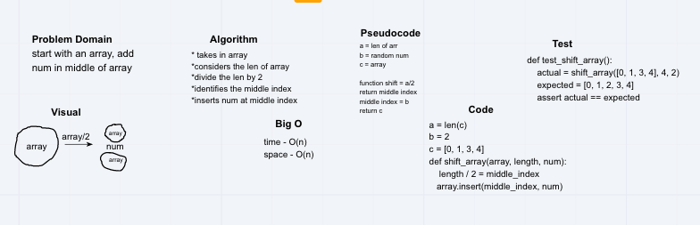

# Challenge Summary
return an array with the new value added at the middle index.

## Challenge Description
take in an array and the value to be added. Without utilizing any of the built-in methods available to your language. Then return the array with the new value added to the middle.

[2,3,4,5,6], 7 -> [2,3]

## Approach & Efficiency
We need to find a way to divide the total number of indicies by 2, get that number, and push the new value into its place. We also need a catch for if the array does not get divided by 2 cleanly.

## Solution

