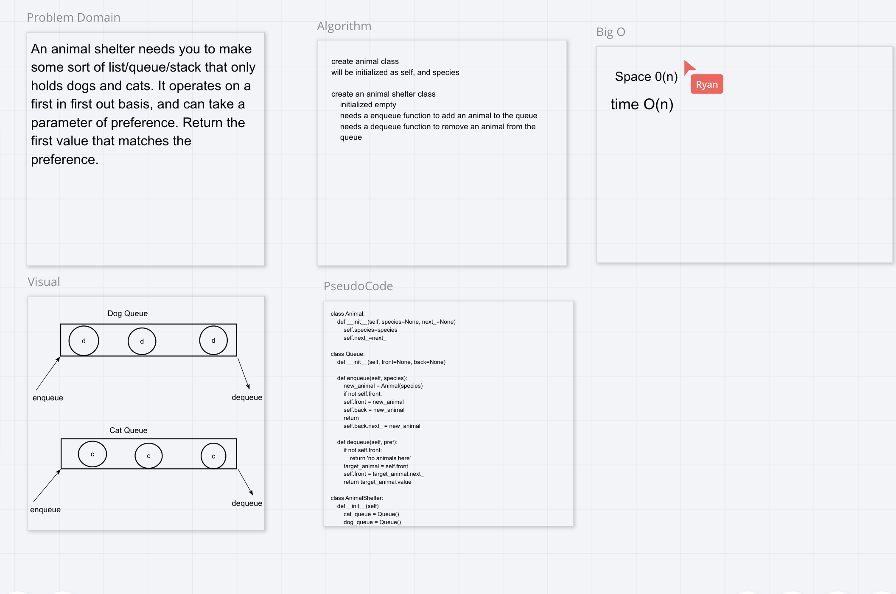

# Challenge Summary
Create a class called AnimalShleter which holds only dogs and cats.

## Challenge Description
Make a class method of AnimalShelter which uses enqueue and dequeue. The enqueue(animal) method should add animal to the shelter, and can be either a dog or a cat. dequeue(pref) returns either a dog or a cat. if pref is not dog or cat then return null.

## Approach & Efficiency
We approached this challenge by making an animal class, a queue class, and an animal shelter class. the animal class acts as a node class, the queue class makes the data structure, and the animal shelter initializes with a dog queue and a cat queue. Animals are then fed into their respective queue. If you dequeue with a preference you will be given the first animal inputted from its respective queue. If the preference is not dog or cat you will be returned null.

## Solution

