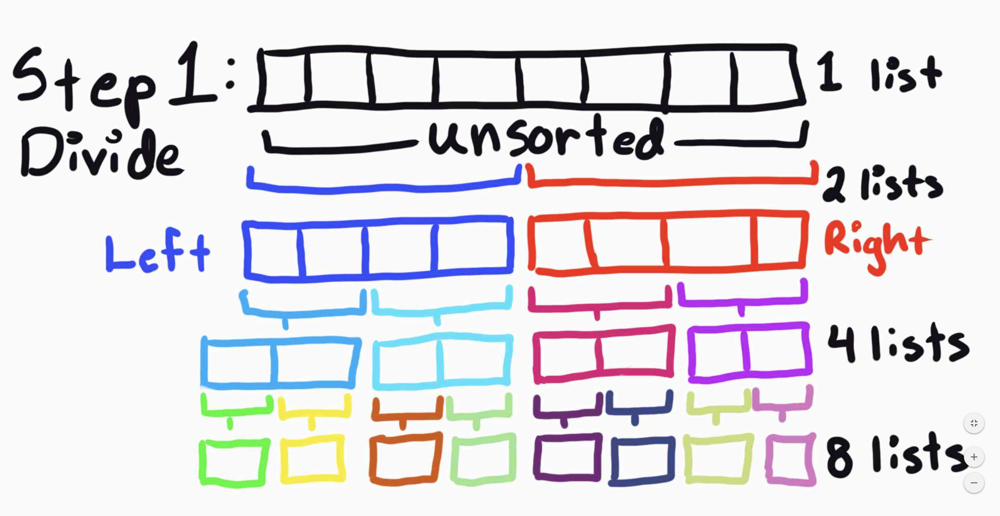
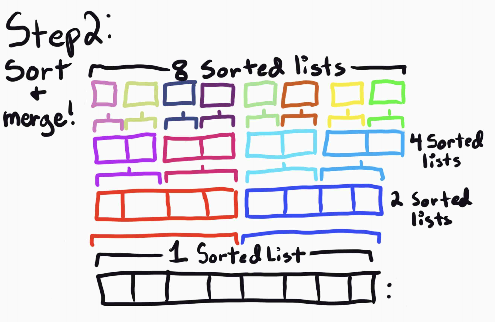

# Challenge Summary
Make a Blog/Picture of the Merge Sort algorithm. Then code and test it.

## Challenge Description
Review the pseudocode below, then trace the algorithm by stepping through the process with the provided sample array. Document your explanation by creating a blog article that shows the step-by-step output after each iteration through some sort of visual.

Once you are done with your article, code a working, tested implementation of Merge Sort based on the pseudocode provided.

## Approach & Efficiency
My approach was to make two functions, one to separate the list, and another to merge it together, but sorted. The first would split the list, and be recursive so no matter how long the list is, it will be broken down into smaller bits. We then send the chopped up list to the merge function that makes a third list using the chopped up bits. if bit a is bigger than b, add it to the list and delete a, if b exists add it to the left of a  and delete it, vice versa, unitl we no longer have bits. then return c.

## Solution

See Code and BLOG.md
