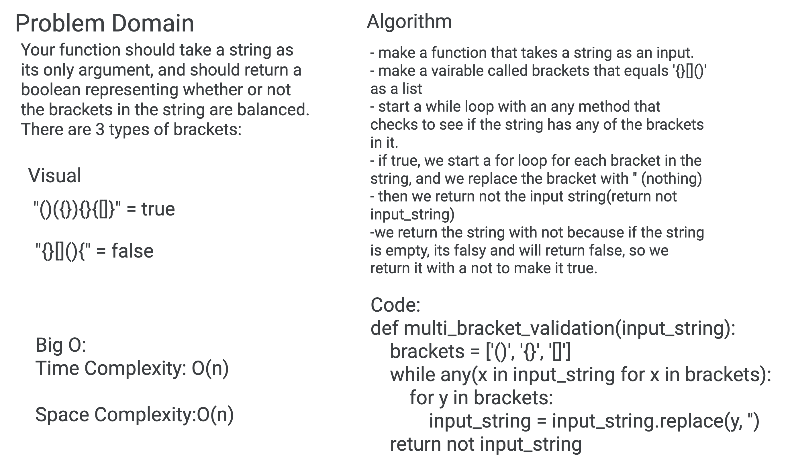

# Challenge Summary
Make a function that checks if each bracket opening has a closing bracket.

## Challenge Description
Your function should take a string as its only argument, and should return a boolean representing whether or not the brackets in the string are balanced. There are 3 types of brackets:

Round Brackets : ()
Square Brackets : []
Curly Brackets : {}

## Approach & Efficiency
I chose to take the approach of removing the bracket pairs from the string, and returning the string afterward. If the string is empty, its good and the function will return true. If the string is not empty, that means there was a mismatch, and we return false. This has a Big O of O(n) time complexity and O(n) for space complexity

## Solution

## Resources
[Geeks for Geeks](https://www.geeksforgeeks.org/check-for-balanced-parentheses-in-python/)
