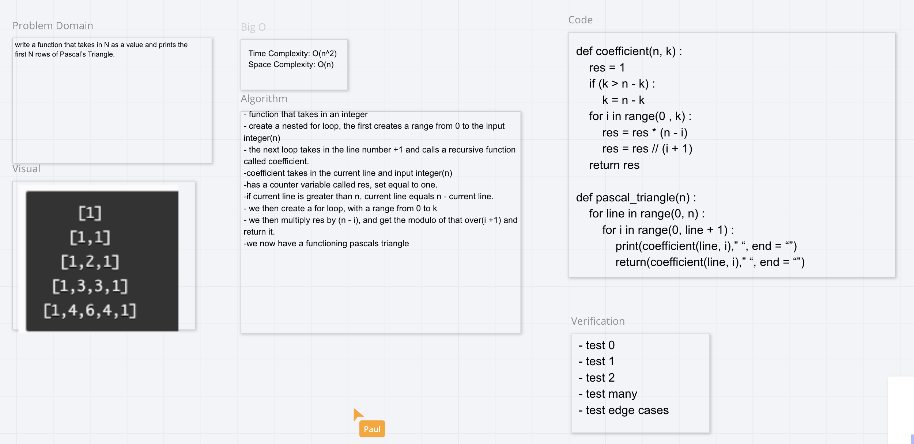

# Challenge Summary
Find a way to make a pascals triangle using code.

## Challenge Description
The rows continue on forever. Assuming that row N = 1 corresponds to that first row, [1], write a function that takes in N as a value and prints the first N rows of Pascal’s Triangle.

## Approach & Efficiency
I chose the approach of using two functions, one to make the first few lines of the triangle, and another that gets recursively called to solve the math for each new line.

## Solution

## Resources
[Geeks for Geeks](https://www.geeksforgeeks.org/pascal-triangle/)
