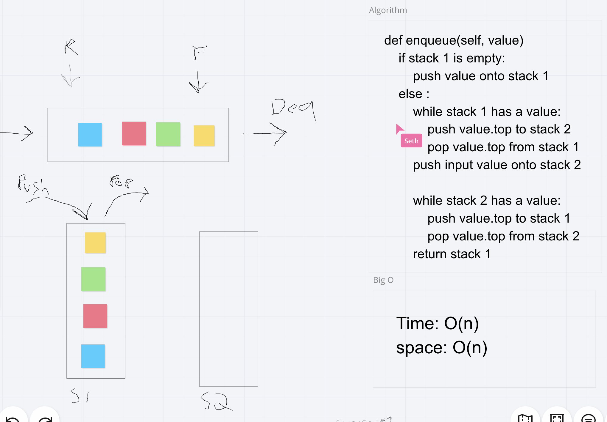

# Challenge Summary
Create a fully functioning PseudoQueue class.

## Challenge Description
Create a brand new PseudoQueue class. Do not use an existing Queue. Instead, this PseudoQueue class will implement our standard queue interface (the two methods listed below), but will internally only utilize 2 Stack objects. Ensure that you create your class with the following methods:

enqueue(value) which inserts value into the PseudoQueue, using a first-in, first-out approach.
dequeue() which extracts a value from the PseudoQueue, using a first-in, first-out approach.

## Approach & Efficiency
When enqueueing we move the top of the first stack into the second stack, then repeat until stack one is empty. Then we push the wanted value onto the top of stack two, and return everything back to stack 1.

## Solution

