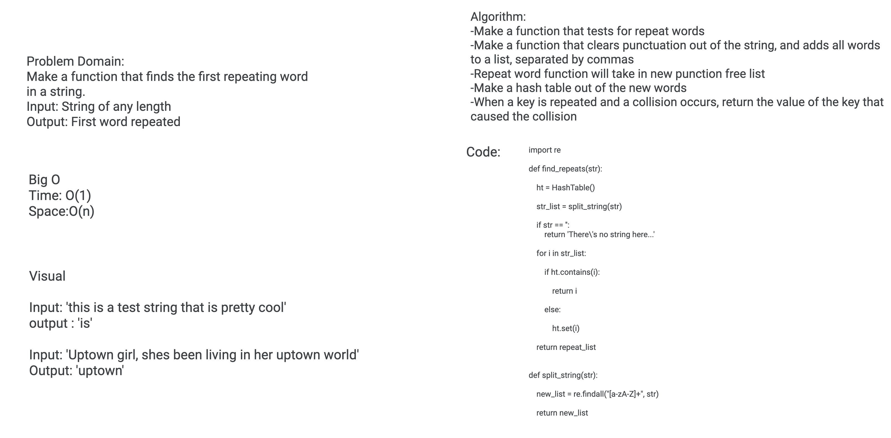

# Challenge Summary
Make a function that takes in a string and returns the first word repeated.

## Challenge Description
Feature Tasks
Write a function that accepts a lengthy string parameter.
Without utilizing any of the built-in library methods available to your language, return the first word to occur more than once in that provided string.

## Approach & Efficiency
I decided to make two separate functions, and utilize hash tables. One function takes in the given string, and runs a regex method against it that removes all the punctuation and returns each word as separate items in a list. The next function takes each word in the list and begins making a hash table out of it. Once the table has a collision (repeated word) it then returns the value of the key that caused the collision.

## Solution

