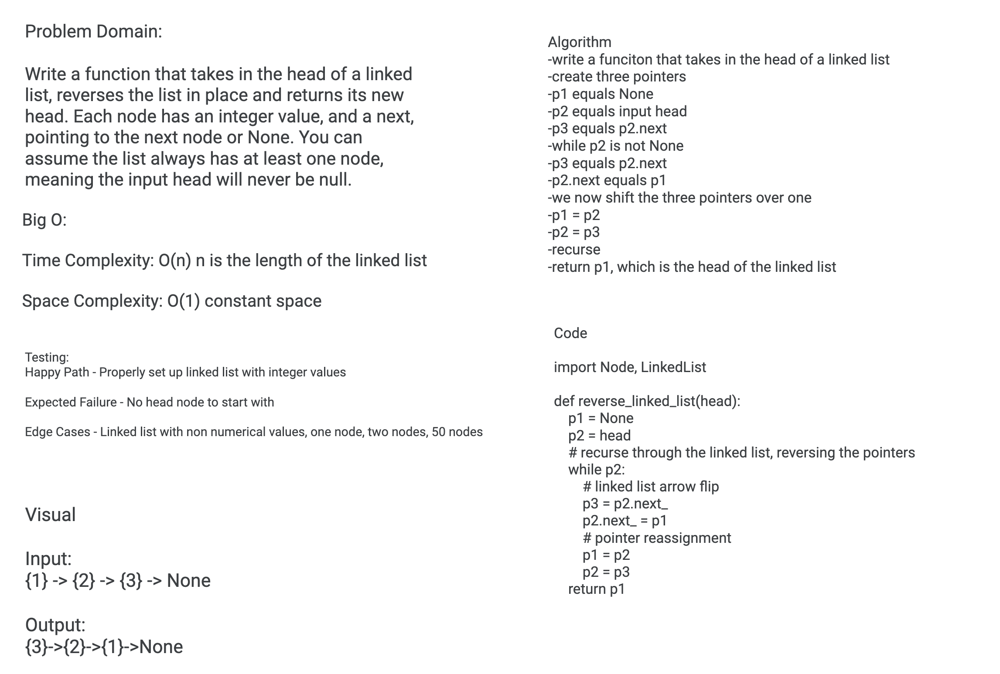

# Challenge Summary
Reverse a linked list

## Challenge Description
Write a function that takes in the head of a linked list, reverses the list in place and returns its new head. Each node has an integer value, and a next, pointing to the next node or None. You can assume the list always has at least one node, meaning the input head will never be null.

## Approach & Efficiency
I chose to take a three pointer approach to this challenge. For simplicity sake, i 'imported' my node and linked list class. For this we will only need the LL method of insert.
 
 First I make a function that takes in the head of a linked list, and in it I declare two variables immediately. First is p1 which equals None. Next is p2 which equals the input head. We then start a recursive *while* loop. In it we define a third variable p3 which equals p2.next. So *while* p2 is not None, p3 = p2.next which sets a checkpoint for us later when we start reversing the list. Then we say p2.next = p1, which reverses the arrow the nodes are pointing at in the linked list. Now we shift our pointer variables, and order matters greatly here. We set p1 = p2, p2 = p3, and we recurse back to the top of the while loop. Once we get through the entire linked list, we return p1 which is the new head of the linked list.
 
post solution note: I ended up making the reverse linked list function a method of the linked list class for testing purposes. The code is the same.

## Solution

## Resources
[AlgoExpert](https://www.algoexpert.io/product)
