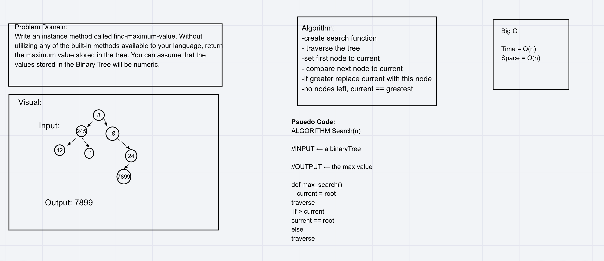
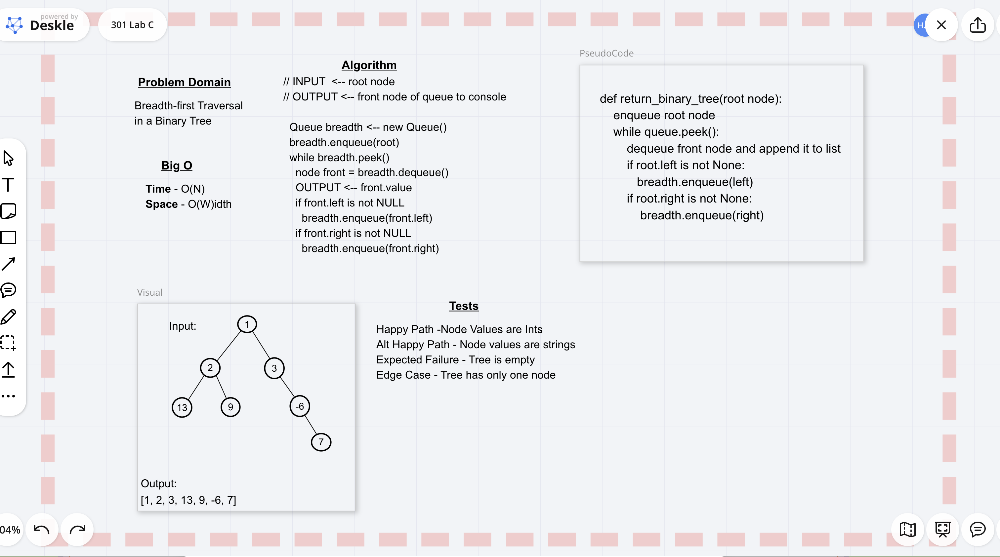

# Code Challenge 16

## Trees
Make a binary tree and a binary search tree with the ability to sort the tree in post and pre order.

### Challenge
Create a Node class that has properties for the value stored in the node, the left child node, and the right child node.
Create a BinaryTree class
Define a method for each of the depth first traversals called preOrder, inOrder, and postOrder which returns an array of the values, ordered appropriately.
Any exceptions or errors that come from your code should be semantic, capturable errors. For example, rather than a default error thrown by your language, your code should raise/throw a custom, semantic error that describes what went wrong in calling the methods you wrote for this lab.

Create a BinarySearchTree class
Define a method named add that accepts a value, and adds a new node with that value in the correct location in the binary search tree.
Define a method named contains that accepts a value, and returns a boolean indicating whether or not the value is in the tree at least once.

### Approach & Efficiency
I approached this with three separate classes. The first would be the node class, which takes in a value, a left and a right. The next is the binary tree class, which holds the functions for how the binary tree will be traversed. The third is creating a binary search tree class which can add values, and search for values in the tree.

### API
Pre-Order sorting will walk the nodes from node, left then right. In-Order sorting will walk the nodes from left, node, then right. Post-Order sorting will walk thee nodes from left, to right, then the node. The add binary search function will place nodes wither to the left or right of the root node. if the value is bigger than the root node, it is placed to the left. If smaller, it is placed to the right. The search method looks at the root node, then compares its value to the desired value, if bigger, we walk to the left, else we go right. We then repeat until the desired value is equal to the root node, or if its left/right is None.

# Code Challenge 17

## Challenge Summary
Make a function of the binary tree class that can return the biggest value of the tree.

### Challenge Description
Write an instance method called find-maximum-value. Without utilizing any of the built-in methods available to your language, return the maximum value stored in the tree. You can assume that the values stored in the Binary Tree will be numeric.

### Approach & Efficiency
We plan to make a function that compares two nodes, and stores the biggest node. We will then traverse the entire tree, comparing every nodes value to the stored value, if bigger, we set the bigger value equal to the stored value. At the end we return the stored value. We will be using a pre-order sort.

### Solution

# Code Challenge 18

## Challenge Summary
Return a list of a binary trees values, using breadth first traversal.
### Challenge Description
Write a breadth first traversal method which takes a Binary Tree as its unique input. Without utilizing any of the built-in methods available to your language, traverse the input tree using a Breadth-first approach, and return a list of the values in the tree in the order they were encountered.

### Approach & Efficiency
we used a loop that fired when the queue is not empty. We first enqueue the root of the tree, then immediately dequeue it once the while loop begins. Every time we dequeue a value, we append it to a list. We then return the list.

### Solution
<!-- Embedded whiteboard image -->

