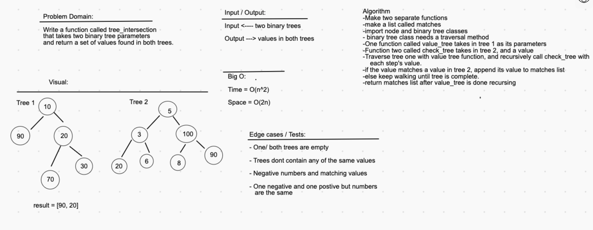

# Challenge Summary
Make a function to check matching values in two binary trees.

## Challenge Description
Write a function called tree_intersection that takes two binary tree parameters.
Without utilizing any of the built-in library methods available to your language, return a set of values found in both trees.

## Approach & Efficiency
I chose the approach of making two binary search trees, and running my previously made 'contains' method from one tree to the other. I know we were supposed to make this work with binary trees, but I couldnt find a way to do it without a big O time complexity of O(n^2) or worse. The solution I ended up using was not what I whiteboarded, and it was not entirely my idea either. My friend Hexx helped me come up with it.

## Solution

