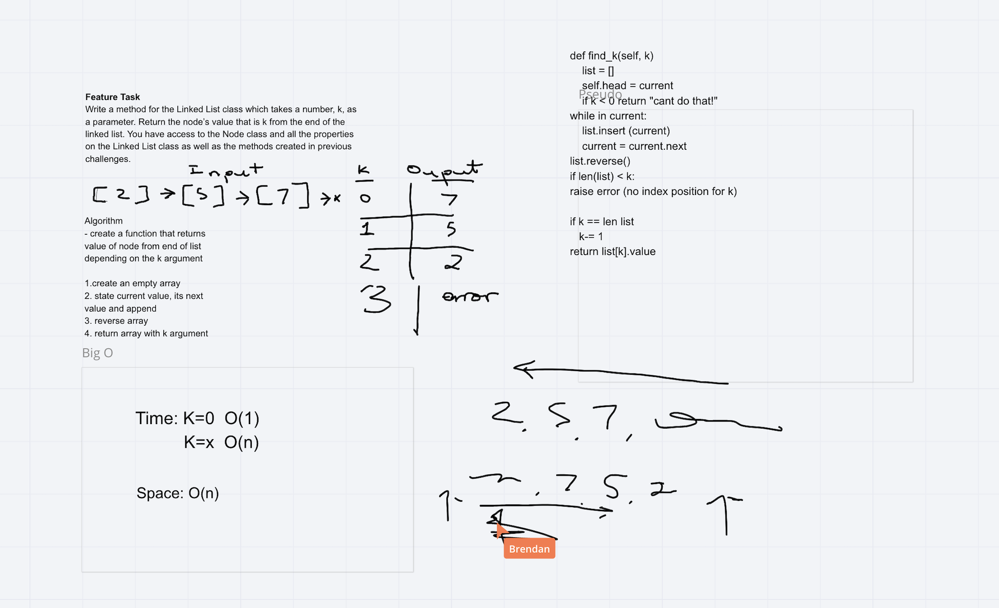
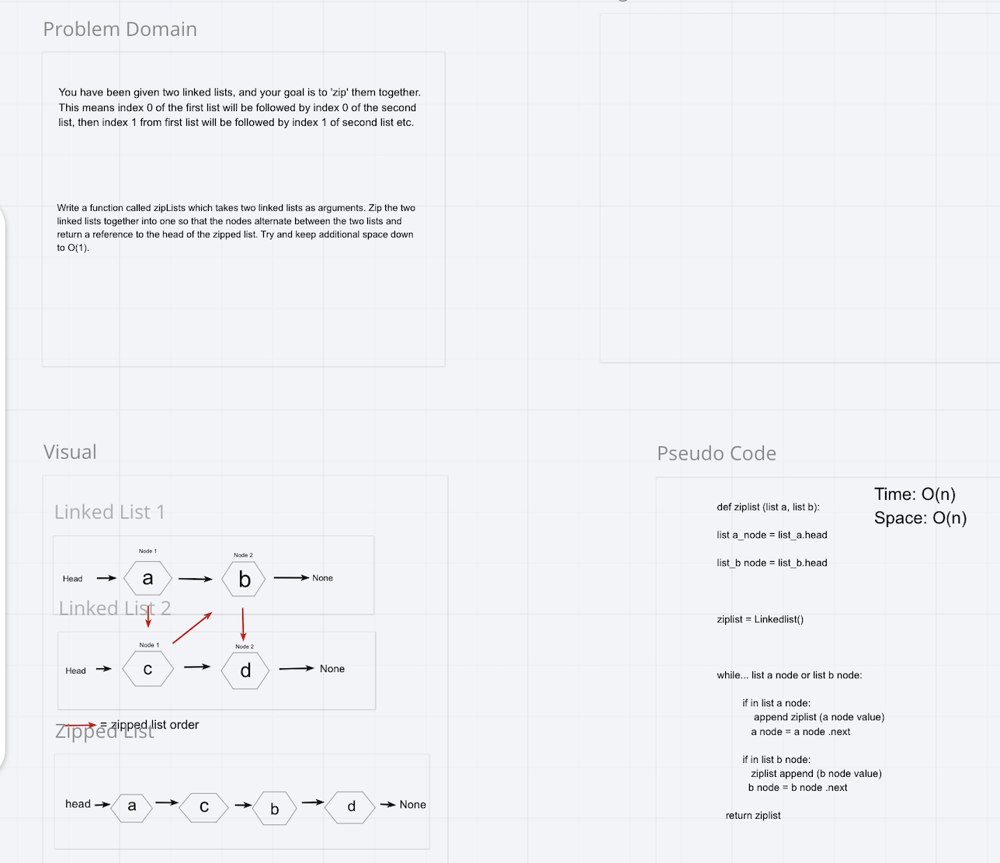

# Singly Linked List
Create a testable node linked list.

## Challenge
create a node class that has properties for the value stored in the Node and a pointer to the next Node.

Write tests to prove the following functionality:

Can successfully instantiate an empty linked list
Can properly insert into the linked list
The head property will properly point to the first node in the linked list
Can properly insert multiple nodes into the linked list
Will return true when finding a value within the linked list that exists
Will return false when searching for a value in the linked list that does not exist
Can properly return a collection of all the values that exist in the linked list
Ensure your tests are passing before you submit your solution.

## Approach & Efficiency
<!-- What approach did you take? Why? What is the Big O space/time for this approach? -->

## API
<!-- Description of each method publicly available to your Linked List -->

[link to first PR](https://github.com/LeeThomas13/data-structures-and-algorithms/pull/17)

[link to second PR](https://github.com/LeeThomas13/data-structures-and-algorithms/pull/18)

# Code Challenge 07

# Challenge Summary
write a funciton kth from end.

## Challenge Description
this function should return a value (k) from the end of a linked list.

## Approach & Efficiency
out intial approach was to make a linked list and then reverse it, and count from the front to the back (k) times. We then refactored this to make a second pointer start going through the linked list once a counter had reached a certain integer.

## Solution

# Code challenge 08

# Challenge Summary
zip two linked lists together.

## Challenge Description
Take in two linked lists, the head of the first list will be followed by the head of the second lists, then index 1 of the first list will be followed by index 1 of the second lists etc...

## Approach & Efficiency
We made a function that will automatically swap between the two lists and append the head of each list to a third list. We then return the third list.

## Solution

